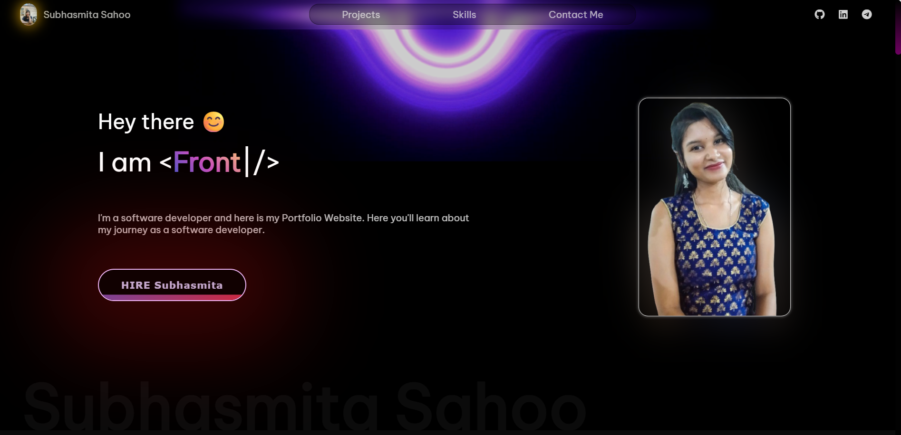
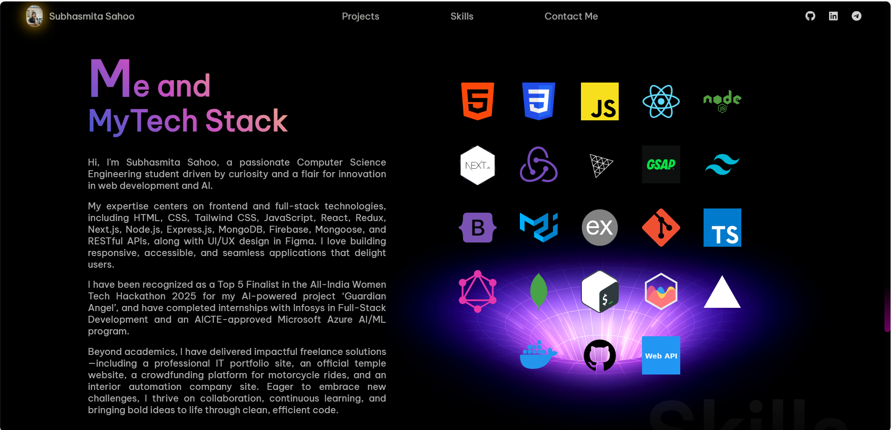
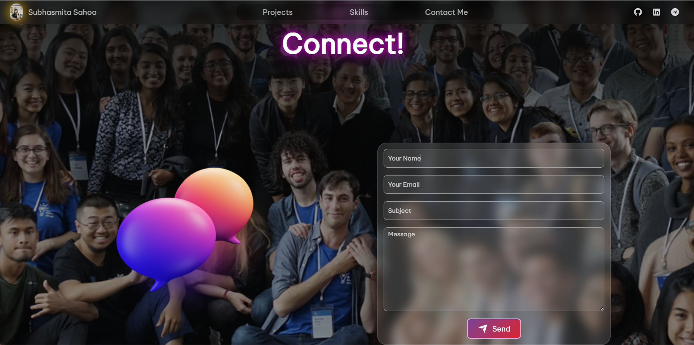

# 🌐 Personal Portfolio Website

Welcome to my **personal portfolio website**! 🚀  
This project is built using **HTML**, **CSS**, and **JavaScript** to showcase my work, skills, and passion for web development.

🔗 **Live Demo:** [Click here to view](https://portfolio-iota-topaz-92.vercel.app/)

---

## ✨ Features

- ⚡ Smooth, responsive design for all devices
- 🖼️ Project gallery with live links
- 📄 Downloadable resume section
- 💡 Modern UI with clean and minimalist design
- 🌙 Dark mode ready (optional improvement!)

---

## 🛠️ Tech Stack

- **HTML5** – Semantic markup
- **CSS3** – Custom styling with animations
- **JavaScript** – Interactivity and DOM manipulation
---

## 📸 Screenshots

| Landing Section | 
|  
| Projects |
  
| Skills |
   
| Contact |
 
---

## 📬 Contact Me

If you’d like to collaborate, hire me, or just say hi, feel free to reach out:

📍 Khordha, Odisha  
📫 Email: subhasmita4602@gmail.com  
🔗 [LinkedIn](https://www.linkedin.com/in/subhasmita-sahoo-puja) |
[Github](https://github.com/subhasmita-puja)

---

## 🧩 Future Improvements

- ✅ Add project filters
- 🔄 Add blog section
- 🔄 Integrate contact form backend

---

## 📝 License

This project is open-source and available under the [MIT License](LICENSE).

---

### 🖤 Thank you for visiting!

> *Crafted with passion using HTML, CSS & JavaScript.*